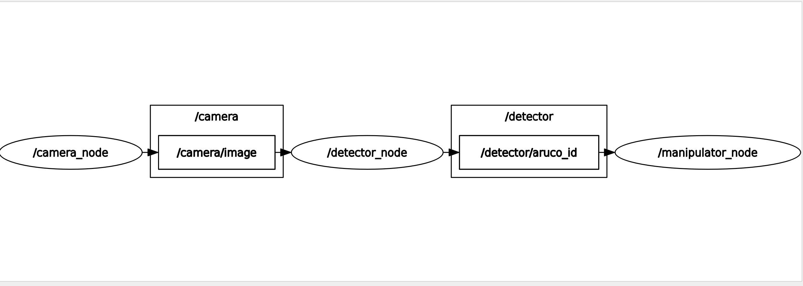

# ROS2 Pick & Place Robot Arm using Computer Vision [](https://github.com/mihir-robotics/ros2_webots/actions/workflows/ci.yml)

ROS 2 package that runs pick-and-place on an Arduino robot arm. A USB camera feeds frames to an ArUco detector; when a marker is seen, the manipulator node sends a configured servo command sequence over serial port.


>GIF is sped up to save time :)
--- 

### Logic Flow


## How it works

1. **camera_node** — captures frames from a V4L2 USB camera and publishes `sensor_msgs/Image` on `/camera/image`.
2. **detector_node** — detects ArUco markers in the camera stream and publishes the marker ID as `std_msgs/Int32` on `/detector/aruco_id`.
3. **manipulator_node** — on each new marker ID, runs the configured pick and place command lists over serial at 9600 baud. Concurrent cycles are rejected while the arm is busy.

If the serial port cannot be opened, the manipulator node logs commands in simulation mode instead of sending them.

### Rqt Graph


## Package structure

```
pick_n_place_bot/
├── src/
│   ├── camera_node.cpp
│   ├── detector_node.cpp
│   └── manipulator_node.cpp
├── include/pick_n_place_bot/
│   ├── camera_node.hpp
│   ├── detector_node.hpp
│   └── manipulator_node.hpp
├── arduino/
│   └── arduino.ino              # Servo firmware (9600 baud)
├── config/
│   └── params.yaml
├── launch/
│   └── robot_arm.launch.py
├── CMakeLists.txt
└── package.xml
```

## Topics

| Topic | Type | Publisher | Subscriber |
|---|---|---|---|
| `/camera/image` | `sensor_msgs/Image` | camera_node | detector_node |
| `/detector/aruco_id` | `std_msgs/Int32` | detector_node | manipulator_node |

## Parameters

All nodes load `config/params.yaml`.

```yaml
camera_node:
  camera_device: "/dev/video0"   # V4L2 device path; falls back to camera_device_id if empty
  camera_device_id: 0
  frame_width: 640
  frame_height: 480
  frame_rate: 30

detector_node:
  aruco_dictionary_id: 0         # 0 = DICT_4X4_50
  marker_size: 0.05
  min_marker_perimeter_rate: 0.80

manipulator_node:
  serial_port: "/dev/ttyUSB0"
  command_delay_ms: 1000
  pick_commands:
    - "home"
    - "gripper-100"
    - "base_y-100"
  place_commands:
    - "base_x-130"
    - "base_y-95"
    - "base_y-90"
    - "gripper-180"
    - "base_y-140"
    - "base_x-40"
    - "base_y-110;shoulder-180"
    - "home"
```

## Serial protocol

Commands are newline-terminated strings sent at 9600 baud. The Arduino sketch in `src/pick_n_place_bot/arduino/arduino.ino` accepts:

- `home` — move all servos to configured home angles
- `<joint>-<angle>` — e.g. `base_x-90`, `shoulder-180`, `gripper-100`
- Multiple commands in one line, separated by `;` — e.g. `base_y-110;shoulder-180`

Pick and place sequences are defined entirely in `params.yaml`.

## USB camera on WSL2

This project is developed on WSL2 with a USB camera passed through via `usbipd-win`. See [Setting Up USB Camera In WSL2](Setting%20Up%20USB%20Camera%20In%20WSL2.md) for kernel, driver, and attach steps.

## Dependencies

- ROS 2 Jazzy
- OpenCV 4.x with ArUco (`libopencv-dev`)
- `cv_bridge`, `image_transport`

```bash
sudo apt-get install -y \
  libopencv-dev \
  ros-jazzy-cv-bridge \
  ros-jazzy-image-transport
```

## Build

```bash
cd ~/ros2_arm_ws
colcon build --packages-select pick_n_place_bot
source install/setup.bash
```

## Run

```bash
ros2 launch pick_n_place_bot robot_arm.launch.py
```

Individual nodes:

```bash
ros2 run pick_n_place_bot camera_node
ros2 run pick_n_place_bot detector_node
ros2 run pick_n_place_bot manipulator_node
```

## Troubleshooting

**Camera not opening**

```bash
ls -l /dev/video*
v4l2-ctl --list-devices
```

On WSL2, confirm the camera is attached with `usbipd` and that `/dev/video0` exists (see USB camera guide above).

**ArUco ID not published**

```bash
ros2 topic echo /detector/aruco_id
ros2 run image_view image_view --ros-args -r image:=/camera/image
```

**Serial port not opening**

```bash
ls -l /dev/ttyUSB* /dev/ttyACM*
```

Upload `arduino/arduino.ino`, match the port in `params.yaml`, and ensure your user is in the `dialout` group.

---