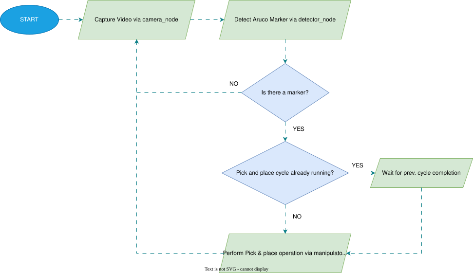
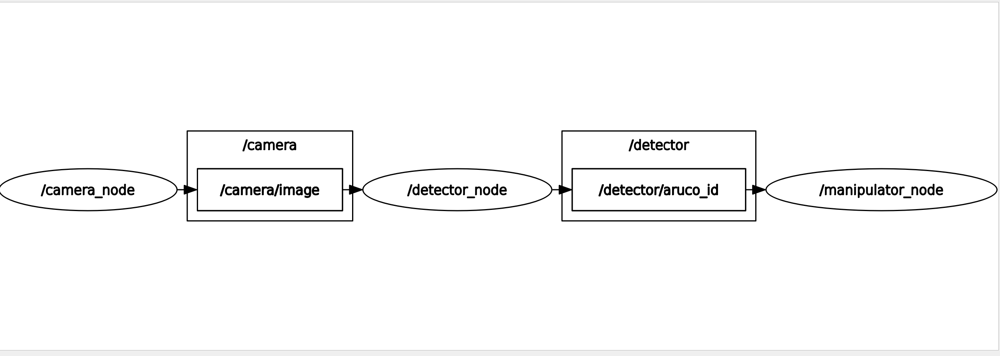

# ROS2 Pick & Place Robot Arm using Computer Vision [](https://github.com/mihir-robotics/ros2_pick_and_place/actions/workflows/ci.yml)

ROS 2 package that runs pick-and-place on an Arduino robot arm. A USB camera feeds frames to an ArUco detector; each **new** ArUco ID triggers one pick-and-place cycle on the manipulator node. Pick and place targets use **analytical inverse kinematics** (built into `manipulator_node`); fixed joint lists still define the idle pre-pick pose and gripper commands. Motion is sent over serial at 9600 baud. The Arduino firmware supports smooth trajectory motion via `pose-*` and duration-based joint commands.


>GIF is sped up to save time :)
--- 

### Logic Flow


## How it works

1. **camera_node** — captures frames from a V4L2 USB camera and publishes `sensor_msgs/Image` on `/camera/image`.
2. **detector_node** — detects ArUco markers in the camera stream and publishes the marker ID as `std_msgs/Int32` on `/detector/aruco_id`.
3. **manipulator_node** — on startup, moves to the pre-pick pose (first entry in `pick_commands`, wrist tilted up). When a **new** ArUco ID arrives on `/detector/aruco_id`, a worker thread runs one cycle:
   - Pre-pick pose (wrist up)
   - IK move to `pick_point_*` with a level gripper → close gripper
   - IK transit at raised height (`transit_z_for_place`, up to `place_clearance_m` above the slot)
   - IK place on the board → open gripper
   - Slow wrist tilt up, retract at transit height (wrist up), slow return to pre-pick

   **Placement:** objects are laid out on a **straight row** in the board plane. Slot `N` is  
   `place_line_origin + N × place_line_step` with **constant** `place_z = place_line_origin_z` (`place_line_step_z` should stay `0.0`). Up to `max_line_slots` unique IDs are handled; duplicate IDs and extra detections while busy are ignored.

If the serial port cannot be opened, the manipulator node logs `[SIM] Command: …` instead of sending serial data.

### Rqt Graph


## Package structure

```
pick_n_place_bot/
├── src/
│   ├── camera_node.cpp
│   ├── detector_node.cpp
│   └── manipulator_node.cpp
├── include/pick_n_place_bot/
│   ├── arm_kinematics.hpp        # Analytical IK (used by manipulator_node)
│   ├── camera_node.hpp
│   ├── detector_node.hpp
│   └── manipulator_node.hpp
├── arduino/
│   └── arduino.ino              # Servo firmware (9600 baud)
├── config/
│   ├── params.yaml
│   └── params.uno_q.yaml      # Arduino UNO Q device paths
├── launch/
│   └── robot_arm.launch.py
├── CMakeLists.txt
└── package.xml
```

## Topics

| Topic | Type | Publisher | Subscriber |
|---|---|---|---|
| `/camera/image` | `sensor_msgs/Image` | camera_node | detector_node |
| `/detector/aruco_id` | `std_msgs/Int32` | detector_node | manipulator_node |

## Parameters

All nodes load parameters from a YAML file. Default: `config/params.yaml`:

```bash
ros2 launch pick_n_place_bot robot_arm.launch.py \
  params_file:=$(ros2 pkg prefix pick_n_place_bot)/share/pick_n_place_bot/config/params.uno_q.yaml
```

```yaml
camera_node:
  ros__parameters:
    camera_device: "/dev/video0"   # V4L2 device path; falls back to camera_device_id if empty
    camera_device_id: 0
    frame_width: 640
    frame_height: 480
    frame_rate: 30

detector_node:
  ros__parameters:
    aruco_dictionary_id: 0         # 0 = DICT_4X4_50
    marker_size: 0.05
    min_marker_perimeter_rate: 0.05

manipulator_node:
  ros__parameters:
    serial_port: "/dev/ttyUSB0"
    command_delay_ms: 750
    pick_commands:
      - "pose-40,50,0,0,180;300"   # Pre-pick / idle (wrist up); first entry only for wait/return
      - "gripper-100"
    link_base_m: 0.06
    link_shoulder_m: 0.065
    link_wrist_m: 0.065
    ee_angle_offset_rad: 0.09
    prefer_elbow_up: true
    pick_point_x: 0.058863          # IK grasp point (meters, arm base frame)
    pick_point_y: -0.070150
    pick_point_z: 0.068012
    place_line_origin_x: 0.064013   # First slot on the board row
    place_line_origin_y: 0.064013
    place_line_origin_z: 0.075962
    place_line_step_x: 0.031850     # Along-row spacing (X/Y only; keep step_z: 0.0)
    place_line_step_y: -0.032803
    place_line_step_z: 0.0
    place_clearance_m: 0.06
    max_line_slots: 3
    gripper_open_width_m: 0.085     # Startup warning if step spacing is tighter than this
```

See `src/pick_n_place_bot/config/params.yaml` for gripper commands, pose durations, and post-place timing fields.

## Serial protocol

Commands are newline-terminated strings sent at 9600 baud. The Arduino sketch in `src/pick_n_place_bot/arduino/arduino.ino` drives five servos (`base_x`, `base_y`, `shoulder`, `wrist`, `gripper`) on pins 3, 5, 7, 9, and 10.

| Command | Example | Behavior |
|---|---|---|
| Instant home | `home` | All joints to home angles `[90, 90, 90, 90, 180]` |
| Trajectory home | `home-500` | Smooth return over 500 ms |
| Instant joint | `gripper-100` | Single joint move |
| Trajectory joint | `wrist-45-500` | Single joint over 500 ms |
| Synchronized pose | `pose-40,50,0,0,180;300` | All 5 joints move together over 300 ms |
| Status | `status` | Responds `JOINTS 90,90,90,90,180` |
| Chaining | `gripper-100;wrist-0-500` | Queued sequentially (`pose-*` is atomic) |

The Arduino prints `DONE` when each command or trajectory finishes. The ROS manipulator node uses a fixed `command_delay_ms` sleep after each command and does not wait for `DONE` — tune the delay to match your trajectory durations.

The pre-pick idle pose and gripper open/close strings live in `pick_commands` and the `gripper_*` parameters. Pick and place **positions** are set with `pick_point_*` and `place_line_*` (tune on hardware using FK/IK logs or a top-down view of the board).

## USB camera on WSL2

This project is developed on WSL2 with a USB camera passed through via `usbipd-win`. See [Setting Up USB Camera In WSL2](Setting%20Up%20USB%20Camera%20In%20WSL2.md) for kernel, driver, and attach steps.

## Arduino UNO Q

Run on the board’s Debian Linux (native or Docker). Device paths differ from WSL (`/dev/video2`, CH340 serial). See [Setting Up On Arduino UNO Q](Setting%20Up%20On%20Arduino%20UNO%20Q.md).

## Dependencies

- ROS 2 Jazzy
- OpenCV 4.x with ArUco (`libopencv-dev`)
- `cv_bridge`

```bash
sudo apt-get install -y \
  libopencv-dev \
  ros-jazzy-cv-bridge
```

## Build

```bash
cd ~/ros2_arm_ws
colcon build --packages-select pick_n_place_bot
source install/setup.bash
```

## Run

```bash
ros2 launch pick_n_place_bot robot_arm.launch.py
```

On Arduino UNO Q, pass `params.uno_q.yaml` (see [Setting Up On Arduino UNO Q](Setting%20Up%20On%20Arduino%20UNO%20Q.md)).

Individual nodes:

```bash
ros2 run pick_n_place_bot camera_node
ros2 run pick_n_place_bot detector_node
ros2 run pick_n_place_bot manipulator_node
```

## Inverse kinematics

Analytical IK lives in `include/pick_n_place_bot/arm_kinematics.hpp` and is called from `manipulator_node` during pick, transit, and place moves. Targets are in meters in the arm base frame (`Z` up). For pick/place, the solver sets a **level gripper**; pre-pick and retract use the wrist angle from `pick_commands` / `pre_pick_wrist_angle`.

Tune link lengths (`link_*_m`), `ee_angle_offset_rad`, and `prefer_elbow_up` under `manipulator_node` in `params.yaml` if solutions fail joint limits or the elbow folds the wrong way. If you see `IK failed` or `No reachable transit height`, reduce `place_line_step_*`, lower `place_clearance_m`, or adjust origins — outer slots are reach-limited.

## Simulation mode

Useful for verifying cycles without hardware:

```bash
source install/setup.bash
ros2 run pick_n_place_bot manipulator_node --ros-args \
  -p serial_port:=/dev/no_such_port \
  -p command_delay_ms:=10
```

Trigger cycles by publishing unique ArUco IDs (best-effort QoS, same as the detector):

```bash
ros2 topic pub --once /detector/aruco_id std_msgs/msg/Int32 "{data: 42}"
```

On WSL2, a single `ros2 topic pub --once` can drop messages; wait for `Pick and place complete` before publishing the next ID, or use a small `rclpy` publisher with `qos_profile_sensor_data`. Expect startup warning when line step spacing is below `gripper_open_width_m` (reach vs. collision tradeoff).

## Troubleshooting

**Camera not opening**

```bash
ls -l /dev/video*
v4l2-ctl --list-devices
```

On WSL2, confirm the camera is attached with `usbipd` and that `/dev/video0` exists (see USB camera guide above).

**ArUco ID not published**

```bash
ros2 topic echo /detector/aruco_id
ros2 run image_view image_view --ros-args -r image:=/camera/image
```

**Serial port not opening**

```bash
ls -l /dev/ttyUSB* /dev/ttyACM*
```

Upload `arduino/arduino.ino`, match the port in `params.yaml`, and ensure your user is in the `dialout` group.

**Pick/place aborts with IK warnings**

Check logs for `IK failed` or `No reachable transit height`. Confirm `pick_point_*` and `place_line_*` use full-precision values (rounded coordinates can hit shoulder &lt; 0°). Reduce step size or slot count if the outer line slot is at max reach.

---